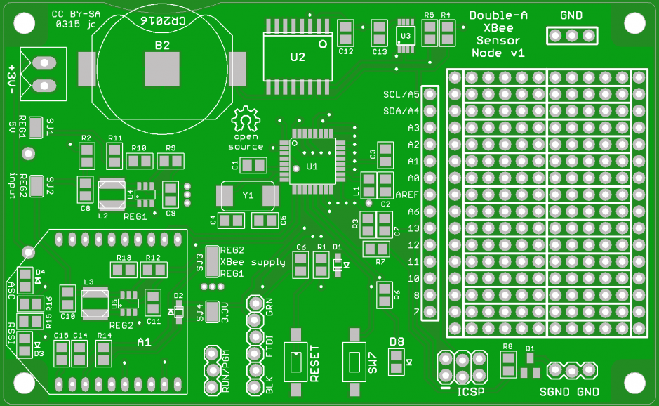

# Double-A XBee Sensor Node #
http://github.com/JChristensen/aaXBee_HW  
ReadMe file  
Jack Christensen Mar 2015  

## Introduction ##

A low-power, Arduino-compatible XBee sensor node that runs on two AA cells.

## CC BY-SA ##
"Double-A XBee Sensor Node" by Jack Christensen is licensed under [CC BY-SA 4.0](http://creativecommons.org/licenses/by-sa/4.0/).
