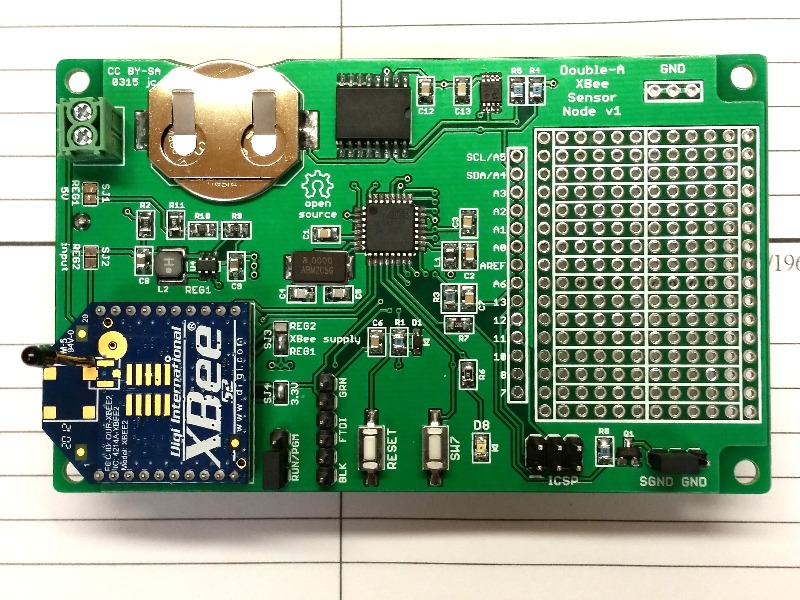

# Double-A XBee Sensor Node #
http://github.com/JChristensen/aaXBee_HW  
ReadMe file  
Jack Christensen Mar 2015  



## Introduction ##
A low-power, [Arduino](http://www.arduino.cc/)-compatible [XBee](http://www.digi.com/products/wireless-wired-embedded-solutions/zigbee-rf-modules/zigbee-mesh-module/xbee-zb-module) sensor node that runs on two AA cells. It should run for over a year on a pair of AA alkaline cells (this could be reduced if sensors that require relatively large amounts of power or on-time are used). For an example sketch, see the [aaXBee sketch](https://github.com/JChristensen/GroveStreams/tree/master/examples/aaXBee) in my [GroveStreams library](https://github.com/JChristensen/GroveStreams). The AA XBee Node will send data to an Arduino running the [gsGateway sketch](https://github.com/JChristensen/GroveStreams/tree/master/examples/gsGateway), which forwards it to the [GroveStreams](https://grovestreams.com/) web site. (Also see my blog post, [A GroveStreams Wireless Sensor Network](http://adventuresinarduinoland.blogspot.com/2015/05/a-grovestreams-wireless-sensor-network.html).)

The AA XBee Node includes an accurate real-time clock ([DS3231](http://www.maximintegrated.com/en/products/digital/real-time-clocks/DS3231.html), ±2ppm from 0°C to +40°C) for precise timing of data transmissions and an accurate on-board I2C temperature sensor ([MCP9808](http://www.microchip.com/MCP9808), ±0.25°C typical). A prototyping area is provided for connecting additional sensors. Twelve microcontroller GPIO pins are available to interface with sensors, including the I2C and SPI buses and analog inputs. A pushbutton switch and an LED are available for application use.

## Features ##
The Double-A XBee Sensor Node is a flexible design with three major configuration options based on the voltage and power required by application-specific sensors. One or two boost regulators are used to supply 3.3V to the XBee and either 3.3V or 5V to the MCU and sensors.These configurations are summarized on page 2 of the [aaXBee_BOM.pdf](https://github.com/JChristensen/aaXBee_HW/blob/dev/aaXBee_BOM.xlsx) file.

Various components are also optional depending on requirements. See page 3 of the [aaXBee_BOM.pdf](https://github.com/JChristensen/aaXBee_HW/blob/dev/aaXBee_BOM.xlsx) file for comments on optional components.

To conserve power, the AA XBee Node disables the boost regulator(s) and sleeps using the battery voltage directly (sleep current is < 5µA). With the regulator(s) disabled, the MCU's clock speed is reduced to avoid overclocking. Because of this, the board should be programmed with an in-circuit serial programmer (ICSP, e.g. AVRISP mkII, USBtinyISP, USBasp, etc.) as opposed to a bootloader. As part of this approach, specific fuse settings are required, so a custom entry in the Arduino boards.txt file is also recommended as follows:
```
##############################################################
aaDL.name=Double-A Datalogger/Double-A XBee Node
aaDL.upload.protocol=arduino
aaDL.upload.maximum_size=32768
aaDL.bootloader.low_fuses=0x7f
aaDL.bootloader.high_fuses=0xde
aaDL.bootloader.extended_fuses=0x06
aaDL.build.mcu=atmega328p
aaDL.build.f_cpu=8000000L
aaDL.build.core=arduino
aaDL.build.variant=standard
##############################################################
```

## CC BY-SA ##
"Double-A XBee Sensor Node" by Jack Christensen is licensed under [CC BY-SA 4.0](http://creativecommons.org/licenses/by-sa/4.0/).
